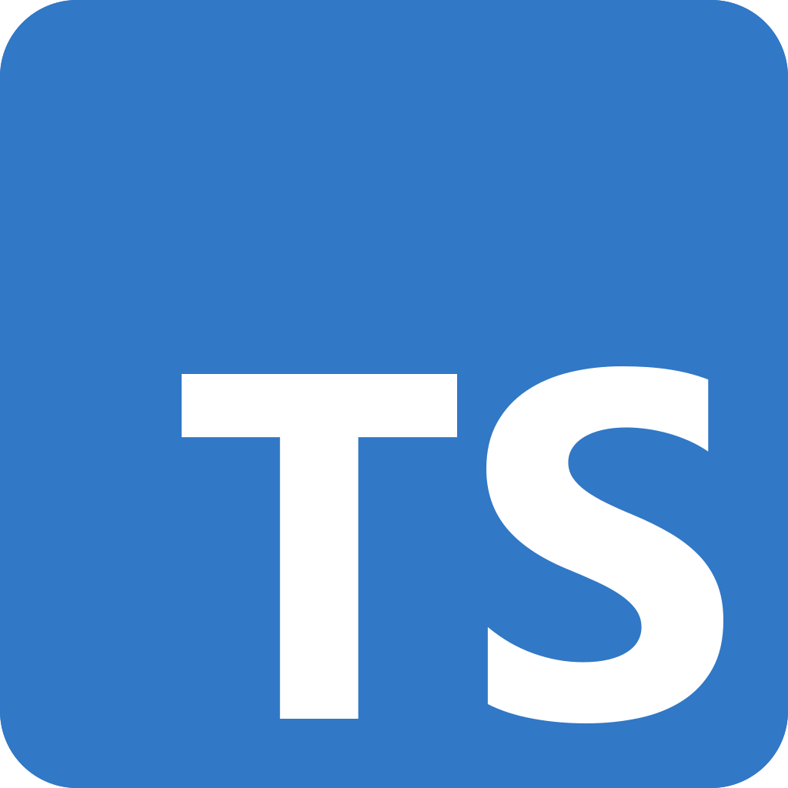
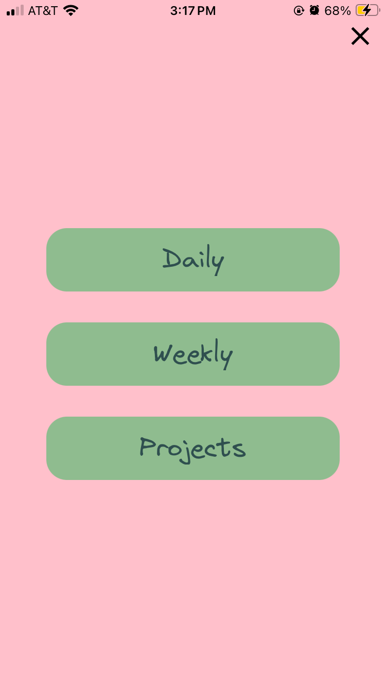
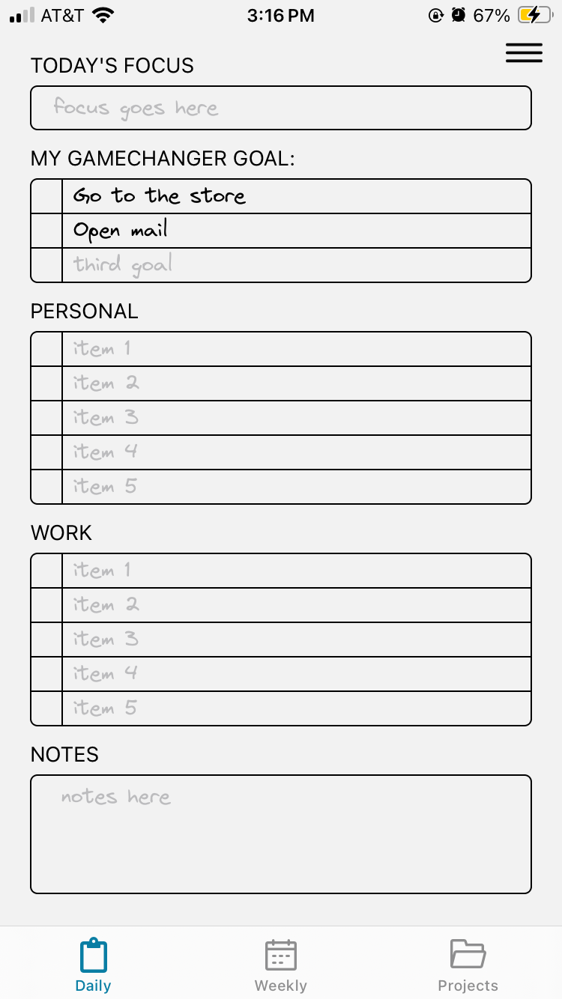
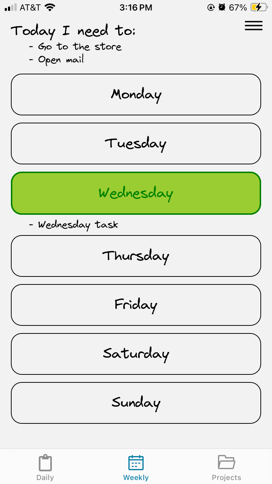
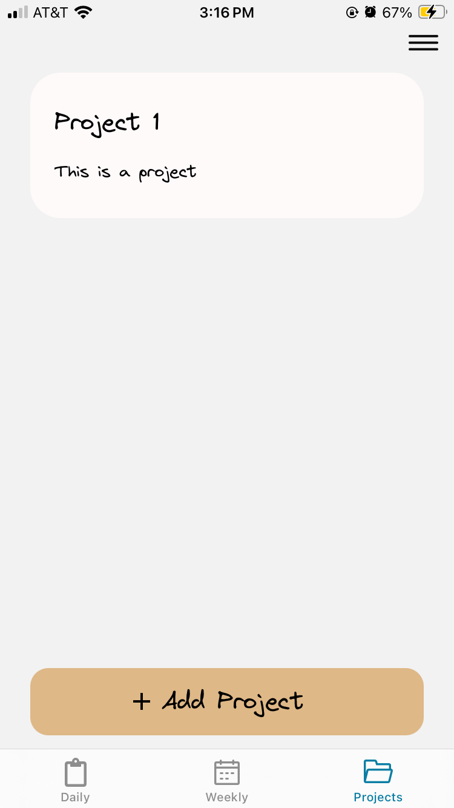
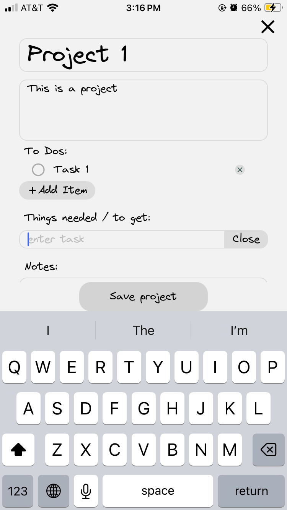

# The Everything app

Meant to be an app that holds everything \*I\* want to keep track of, morphed into a daily goal tracking app.

## Tech Stack

 React Native

 Typescript

## Features

- A menu and tabs for ease of navigation

 

- A daily view page to keep track of and prioritize tasks

 

- A weekly view page that syncs with the daily task view

 

- A project view that allows you to keep track of current projects

 
 

## Installation Instructions

### Prereqs

- Node.js

### Steps

1. Install dependencies

   ```bash
   npm install
   ```

2. Start the app

   ```bash
   npx start
   ```

In the output, you'll find options to open the app in a

- [development build](https://docs.expo.dev/develop/development-builds/introduction/)
- [Android emulator](https://docs.expo.dev/workflow/android-studio-emulator/)
- [iOS simulator](https://docs.expo.dev/workflow/ios-simulator/)
- [Expo Go](https://expo.dev/go), a limited sandbox for trying out app development with Expo

## Future Work

There currently is no plan to improve this app. This project was with the intention of digging my hands into React Native.
